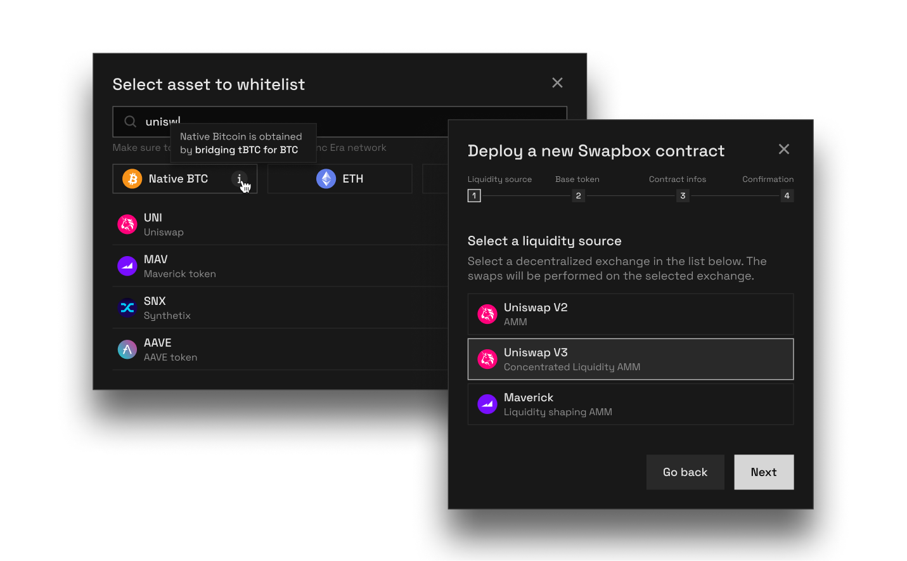
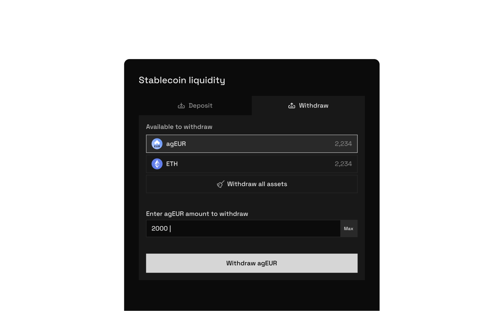
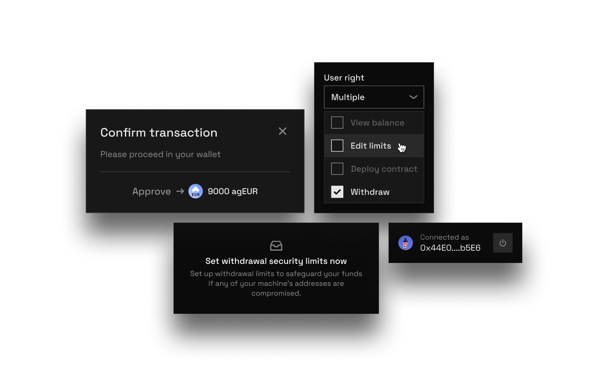
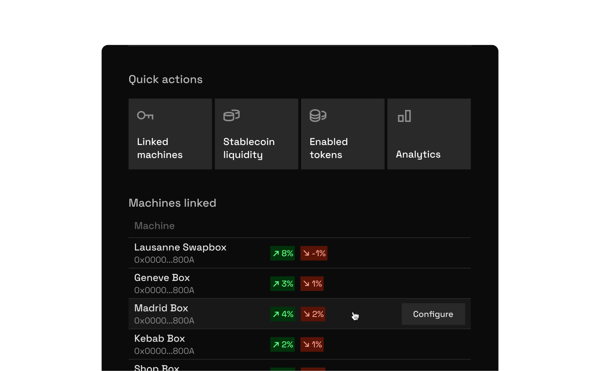
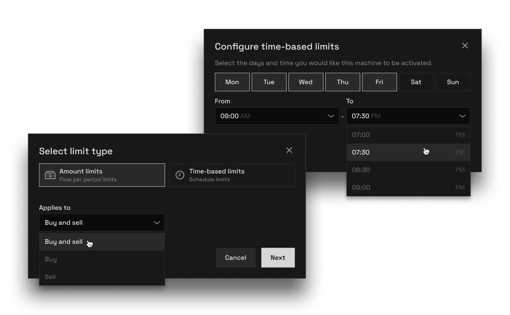
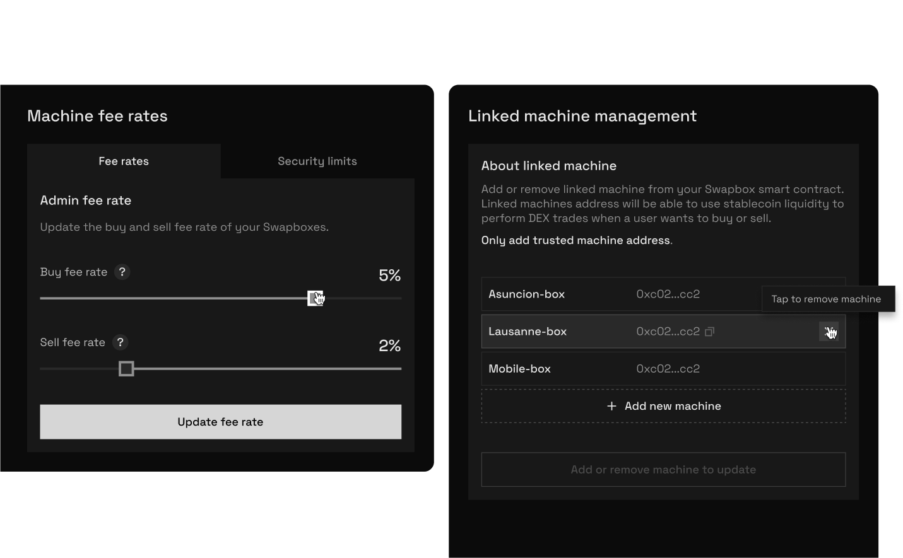
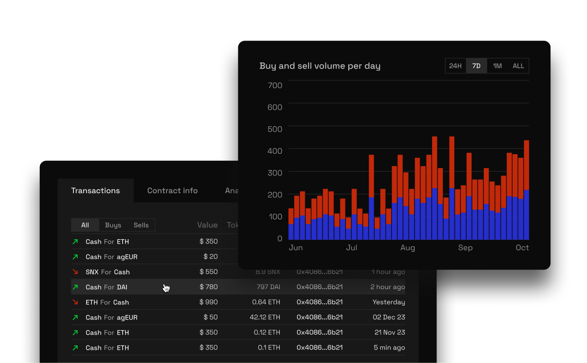

## Admin decentralized dApp: the core value of Swapbox

The admin dApp is used by Swapbox operators to control their fleet. It is an essential component of Swapbox; used to deploy a Swapbox smart contract, choose a stablecoin used as liquidity, configure the fee rates, link and unlink machines, set transaction limits, explore detailed analytics, etc.

Swapbox dApp is a complex system composed of 3 main components:
#### 1. Contract deploylement
Deploy and configure a Swapbox contract. The configuration is structured in 3 parts:
1. AMM selection
2. Stablecoin selection
3. Contract information (name)

#### 2. Contract and machines management
Management of contract wide settings, such as stablecoin liquidity, liquidity withdrawals and deposits, fee collecting, linked machines management and whitelisted tokens.

Management of machine wide settings, such as fee rates and transactions limits

#### 3. Analytics
Transaction explorer, contract information, and custom charts to display the most relevent information of a contract and its machines.

