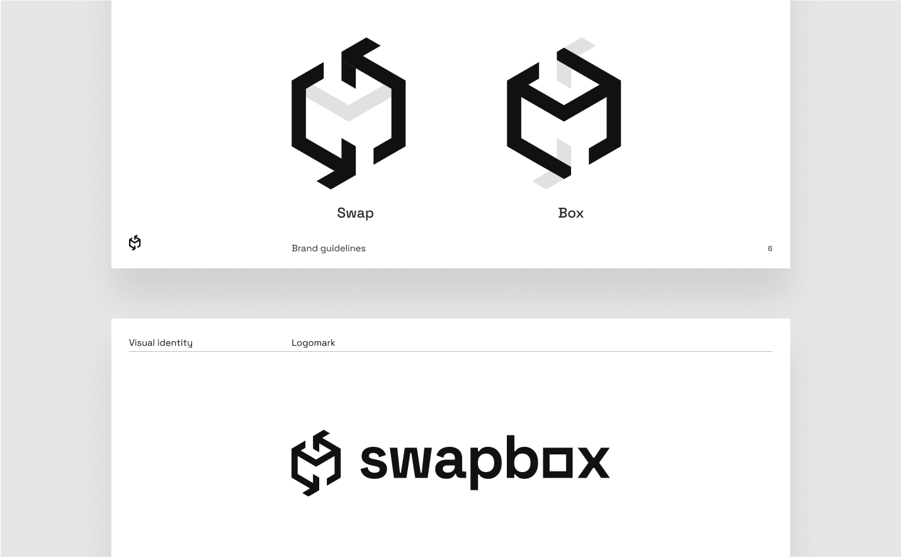

# Design leading for a new generation of crypto ATM

### The project

Swapbox is a decentralized, serverless, open-source crypto cash machine project. The main goal of the project is to enhance financial inclusivity and fairness by reducing the friction between on and off-ramp crypto-currencies. In other words, Swapbox aims to be a decentralized bridge between the alternative of traditional finance and physical cash.

### The context

I joined Swapbox in 2021, as the design owner. Back then, every thing was yet to build: the brand, the design system, the different interaces, the communication channels. I started by designing a strong brand, reflecting the value of the project: open-source, decentralization, fairness.

## Strong and recognizable branding and design system

## Optimized user interface for the machine

Swapbox is powered by Raspberry Pi, and the interface is developed with Python and the Kivy framework. The low-power hardware combined with the Kivy framework created challenges of feasibility and performance, on top of the required seamless user experience for buying and selling crypto assets.

Swapbox's target countries are underdeveloped. I had to have this in mind to use **concise and strong wording** to make it understandable to most, even those unfamiliar with crypto-currencies.

**Contrast is important**, especially on touchscreen devices in bright public places. Clickable elements must feel clickable. 

The progress status on the left is an important aspect of the interface; it serves 2 purposes:

- Show the progress of the user
- Show the previous selection  

It can show more without cluttering the information on a size-limited screen.

**Flags for language selection** have been longely debated internally. We read studies about the subject: It is more intuitive for less educated people to match their flag to their speaking language. On the other hand, it might offend people to have a Spanish flag to represent Spanish in Mexico: we decided to match each country's flag to its main language, in order to use the country's flag for its main language.

## Admin decentralized dApp: the core value of Swapbox

The admin dApp is used by Swapbox operators to control their fleet. It is an essential component of Swapbox; used to deploy a Swapbox smart contract, choose a stablecoin used as liquidity, configure the fee rates, link and unlink machines, set transaction limits, explore detailed analytics, etc.

Swapbox dApp is a complex system composed of 3 main components:
#### 1. Contract deploylement
Deploy and configure a Swapbox contract. The configuration is structured in 3 parts:
1. AMM selection
2. Stablecoin selection
3. Contract information (name)

#### 2. Contract and machines management
Management of contract wide settings, such as stablecoin liquidity, liquidity withdrawals and deposits, fee collecting, linked machines management and whitelisted tokens.

Management of machine wide settings, such as fee rates and transactions limits

#### 3. Analytics
Transaction explorer, contract information, and custom charts to display the most relevent information of a contract and its machines.

## Illustrations, diagram and other design work

